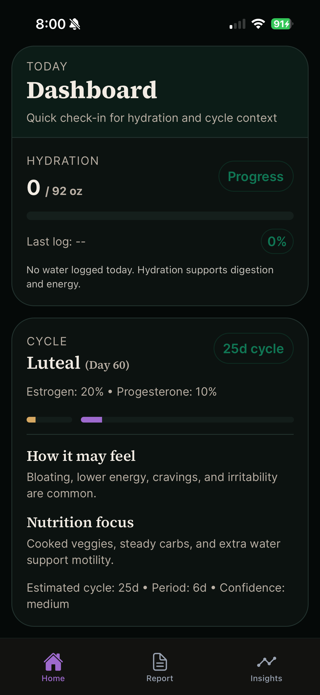
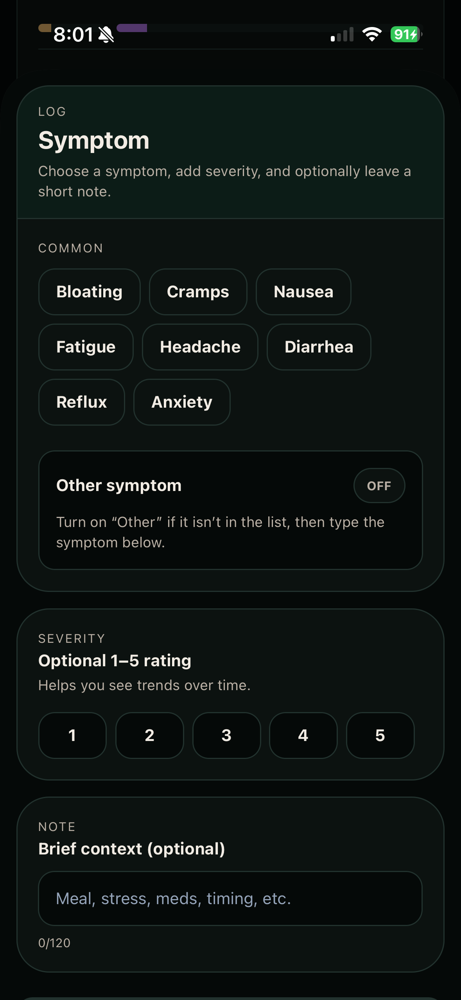
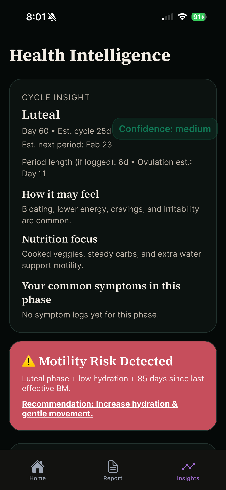
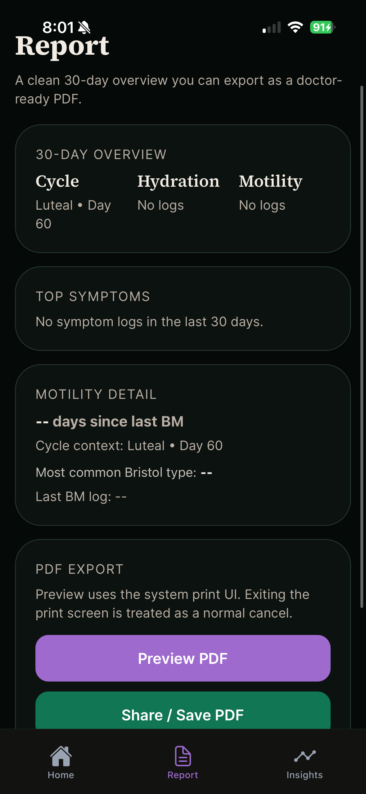

# Rhythm Ledger

A private mobile health tracking application built for a single user to collect, organize, and report on their own private health data. Designed and developed in three weeks by a solo developer with a clinical nursing background.

Rhythm Ledger is not a generic wellness app. It was built around a specific clinical insight: hormones are the body's messengers, symptoms rarely occur in isolation. Hydration status, menstrual cycle phase, bowel motility, and daily symptoms can give clinicians or the person great insight when collected and analyzed. Tracking them together tells a more complete story than tracking any one of them alone.

---

## Screenshots

| Dashboard | Symptom Log | Health Intelligence | Report |
|---|---|---|---|
|  |  |  |  |

---

## Features

**Dashboard**
- Daily hydration progress toward a personalized goal (oz)
- Current menstrual cycle phase with estimated hormone levels
- Contextual guidance on how the current phase may feel and what nutrition supports it

**Logging**
- Symptoms: common presets plus free-text input, with a 1-5 severity rating and optional note
- Medications: log what was taken and when
- Hydration: fluid intake tracking throughout the day
- GI / Bowel movements: Bristol scale logging
- Menstrual cycle: period and flow tracking

**Health Intelligence**
- Cycle phase analysis with estimated ovulation and next period dates
- Cross-variable insights that flag conditions like low hydration during the luteal phase that increase motility risk
- Phase-specific symptom patterns drawn from the user's own logged history
- Recommendations based on combined data inputs

**Report**
- 30-day overview of cycle, hydration, motility, and top symptoms
- Exportable as a doctor-ready PDF the user can share or download directly from the app
- Formatted so a medical provider can quickly read the patient's recent health picture

**Privacy**
- Sensitive health entries are payload-encrypted before being stored in Supabase
- Built for a single private user with no data sharing or third-party analytics

---

## Tech Stack

| Layer | Technology |
|---|---|
| Framework | Expo (React Native) |
| Language | TypeScript |
| Backend / Database | Supabase (PostgreSQL) |
| Authentication | Supabase Auth |
| UI Design | Figma |
| IDE | VS Code |

---

## Architecture Notes

- File-based routing via Expo Router
- Modular tab structure: home, log (cycle, gi, hydration, medication, symptom, trends), insights, report
- Supabase handles user authentication and persistent data storage
- PDF export uses the system print UI, triggered from the Report tab
- Currently deployed as a private app on a single Android device via Expo Go

---

## Why This Exists

This app was built for one person. Not as a class project or a portfolio exercise. I cared, had an idea, and have been learning how I could build my idea.

The clinical reasoning behind it comes from six years of nursing. Hormones regulate nearly every system in the body, and women's health data is most useful when it is longitudinal, contextual, and readable by a medical provider. Most tracking apps do one thing. This one connects them.

---

## Status

Private deployment. Not yet publicly available. Built and maintained by a solo developer.

---

## Developer

Diane Goy
[linkedin.com/in/dianegoy360](https://www.linkedin.com/in/dianegoy360/) • [github.com/dianegoy](https://github.com/dianegoy)
